////
 userguide.adoc

-------------------------------------------------------------------------------
   Copyright 2016 Kevin Morey <kevin@redhat.com>

   Licensed under the Apache License, Version 2.0 (the "License");
   you may not use this file except in compliance with the License.
   You may obtain a copy of the License at

       http://www.apache.org/licenses/LICENSE-2.0

   Unless required by applicable law or agreed to in writing, software
   distributed under the License is distributed on an "AS IS" BASIS,
   WITHOUT WARRANTIES OR CONDITIONS OF ANY KIND, either express or implied.
   See the License for the specific language governing permissions and
   limitations under the License.
-------------------------------------------------------------------------------
////

= ServiceNow_Incident User Guide
This user guide will walk you through various integrations with ServiceNow incident management.

== Table of Contents
* <<Create Incident via Custom Button>>
* <<Resolve Incident via Custom Button>>
* <<Close Incident via Custom Button>>
* link:troubleshooting.adoc[Troubleshooting Guide]

=== Create Incident via Custom Button

* Log into your CloudForms/ManageIQ UI.
* Navigate to a VM or instance.
* Under the *ServiceNow* button group select *Create Incident*.

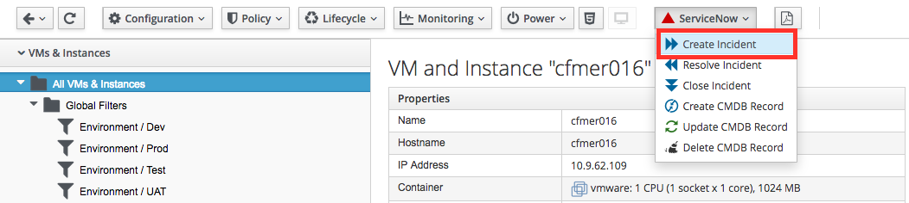

* Enter your problem description and hit Submit.

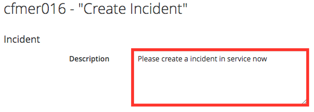

* Navigate to your ServiceNow instance and look at the *Incidents*. You should see details of your incident. Note the *Number*, *Short Description*, *State*, *Comments*.

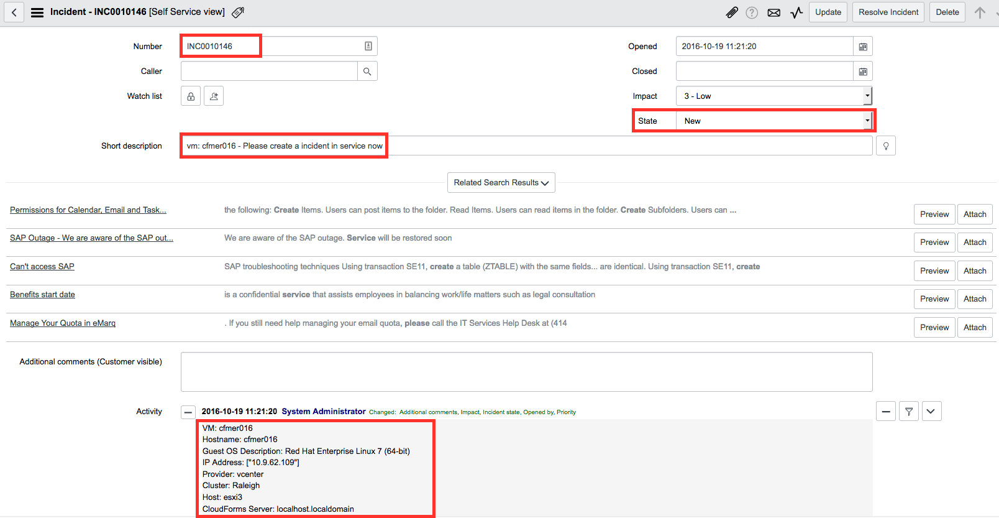

* Navigate back to your VM or instance. At the bottom of the summary page you should see *Custom Attributes* containing ServiceNow Incident attributes.

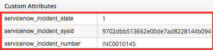

<<top>>

=== Resolve Incident via Custom Button

* Navigate to a VM where you have previously created the incident.
* Under the *ServiceNow* button group select *Resolve Incident*.

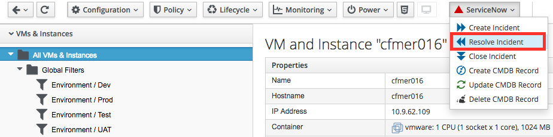

* Enter your problem description and hit Submit.

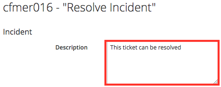

* Navigate to your ServiceNow instance and look at the *Incidents*. You should see details of your incident. Note the *Number*, *State*, *Comments*.

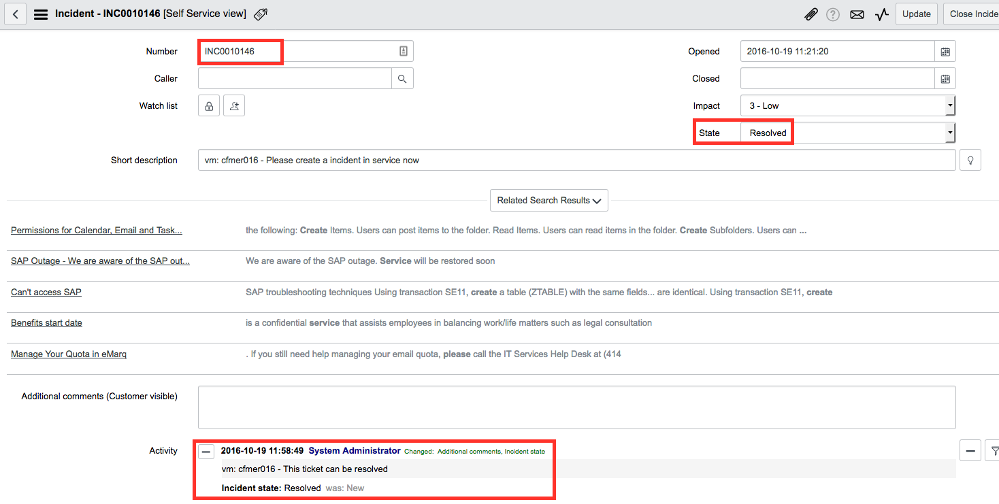

* Navigate back to your CloudForms VM or instance. At the bottom of the summary page you should see *Custom Attributes* containing updated ServiceNow Incident attributes.

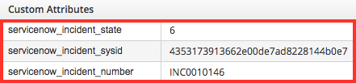

<<top>>

=== Close Incident via Custom Button
Steps to close an incident:

* Navigate to a VM where you have previously created the incident.
* Under the *ServiceNow* button group select *Close Incident*.

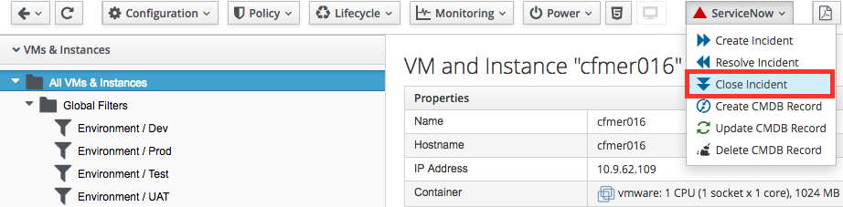

* Enter your problem description and hit Submit.

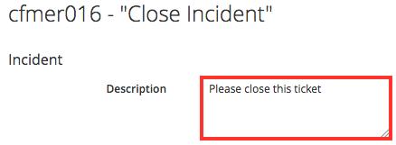

* Navigate to your ServiceNow instance and look at the *Incidents*. You should see details of your incident. Note the *Number*, *State*, *Comments*.

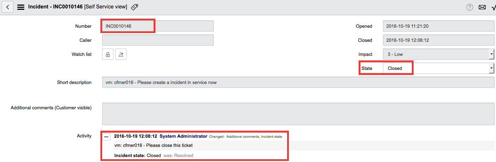

* Navigate back to your CloudForms VM. At the bottom of the summary page you should see *Custom Attributes* containing ServiceNow Incident attributes are gone.

<<top>>
